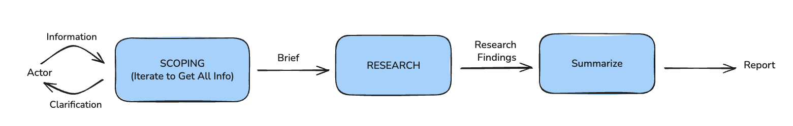

# simple-deep-research

## About

This repo contains slides and notebooks for a workshop on implementing Simple Deep Research workflow using LangGraph.

## Deep Research

Deep Research is composed of these steps

## Notebooks

[Setup](notebooks/00_setup.ipynb).   
In order to make sure everything is setup properly, this notebook validates the keys/python env is setup

[LangGraph Basics](notebooks/01a_langgraph_basics.ipynb)  
[LLM Basics](notebooks/01b_llm_basics.ipynb).   
The above notebooks covers some basics.

[Scoping](notebooks/02_scoping.ipynb)

[Research Step as a Workflow](notebooks/03a_research_as_workflow.ipynb).   
[Research Step as a agent](notebooks/03_research_as_agent.ipynb)

[Write Report](notebooks/04_write_report.ipynb)

[Full Graph](notebooks/05_full_graph.ipynb)

## Workshop Info

The notebooks requires OpenAI and Tavily API keys.  
During the workshop, a proxy server is used to avoid providing the keys.

If you want to use your keys or run the notebooks after the workshop, copy [.env.example](.env.example) to `.env` and fill in your values.

## Sample Reports

Seattle Coffee Shop
- [Gemini](https://gemini.google.com/share/0911c9b077e2) , [pdf](reports/report_gemini.pdf)
- [ChatGPT](https://chatgpt.com/share/690e8013-94cc-800a-9751-44d2a2c6f125) , [pdf](reports/report_chatgpt.pdf)
- [Repo Report](reports/report_custom.md)

## Slides

[Proposal](workshop/pydata_2025_proposal.md)

## Contact

For help or feedback, please reach out to :

- [Nidhin Pattaniyil](https://www.linkedin.com/in/nidhinpattaniyil/)   
- [Ravi Yadav](https://www.linkedin.com/in/ravi-kumar-yadav-535b268/)   

## Acknowledgemnt
LangChain Academy has this great course [Deep Research with LangGraph](https://academy.langchain.com/courses/deep-research-with-langgraph) , where the authors learned a lot from.
